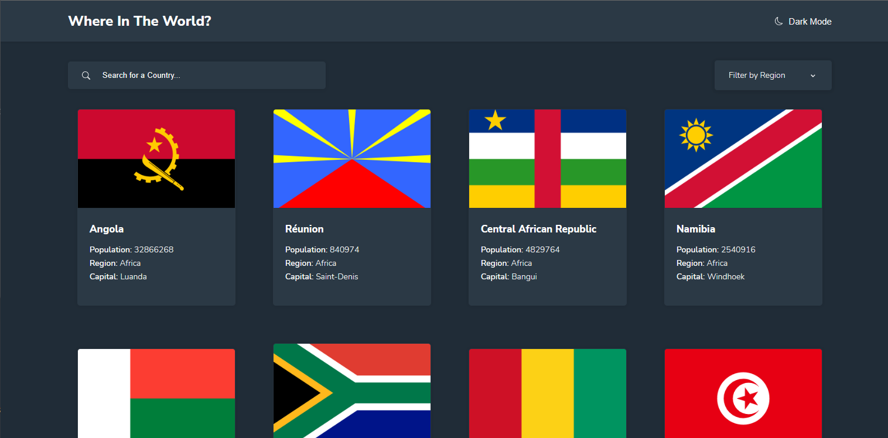

# Frontend Mentor - REST Countries API with color theme switcher solution

This is a solution to the [REST Countries API with color theme switcher challenge on Frontend Mentor](https://www.frontendmentor.io/challenges/rest-countries-api-with-color-theme-switcher-5cacc469fec04111f7b848ca). Frontend Mentor challenges help you improve your coding skills by building realistic projects.

## Table of contents

- [Overview](#overview)
  - [The challenge](#the-challenge)
  - [Screenshot](#screenshot)
  - [Links](#links)
- [My process](#my-process)
  - [Built with](#built-with)
  - [What I learned](#what-i-learned)
  - [Continued development](#continued-development)
  - [Useful resources](#useful-resources)
- [Author](#author)
- [Acknowledgments](#acknowledgments)

## Overview

### The challenge

Users should be able to:

- See all countries from the API on the homepage
- Search for a country using an `input` field
- Filter countries by region
- Click on a country to see more detailed information on a separate page
- Click through to the border countries on the detail page
- Toggle the color scheme between light and dark mode

### Screenshot

### Links

- Solution URL: [Code](https://github.com/servant-of-Allah/restCountryApp.git)
- Live Site URL: [Live](https://your-live-site-url.com)

## My process

### Built with

- Semantic HTML5 markup
- CSS custom properties
- Flexbox
- CSS Grid
- Mobile-first workflow
- [React](https://reactjs.org/) - JS library

### What I learned

working through this advanced level project from frontendMentor, i learned how to properly handle Api based application including error handling and structuring the app. most of the functionality added to the app were kinda basic. but the theme toggling part was new for me. i didn't use this process of changing the theme before. it was a great step i think. besides i thought of using a css framework like bootstrap or tailwind css but the css needed weren't that much. so i decided to stick with css3 in general. i got some improvements in my css too. especially in the detail country info section of the app.

### Useful resources

there were some useful resources that i found some help throughout my project. but unfortunately i didn't keep note of them.

## Author

- Frontend Mentor - [@servant-of-Allah](https://www.frontendmentor.io/profile/servant-of-Allah)
